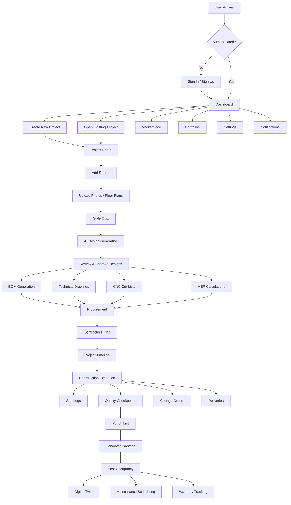
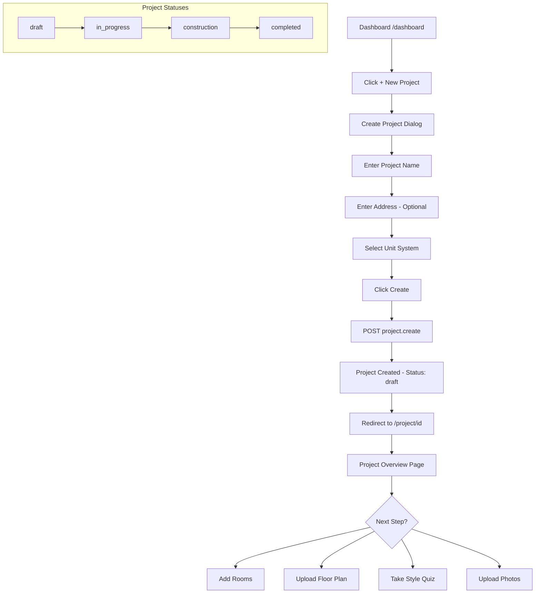
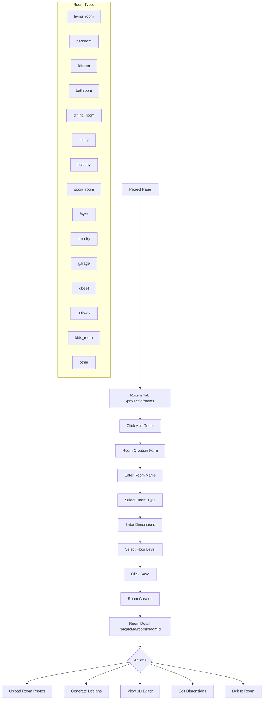
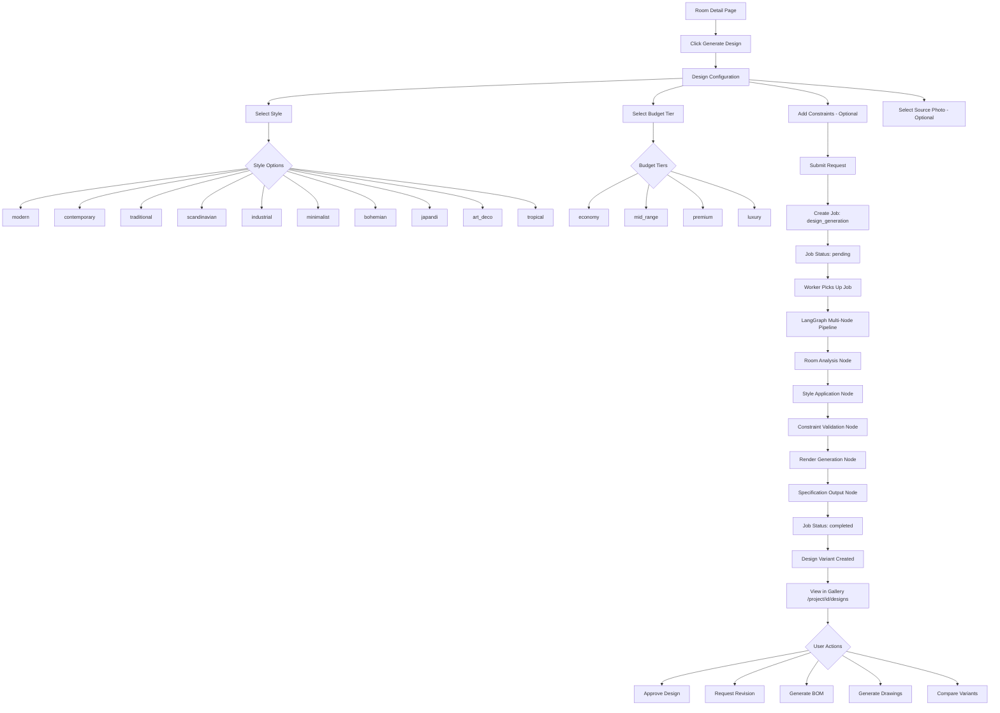
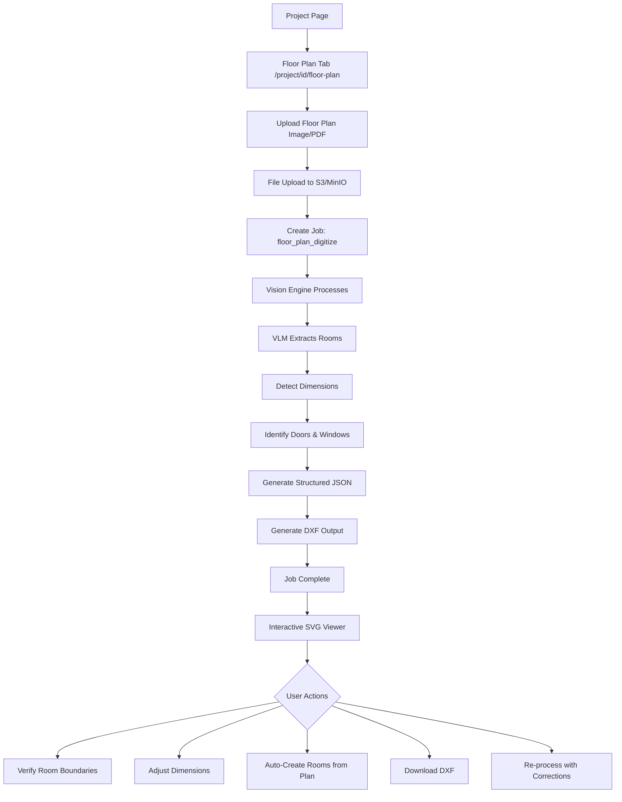
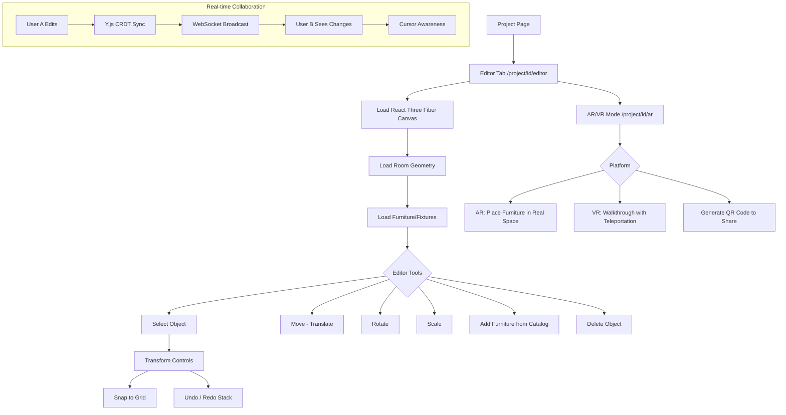
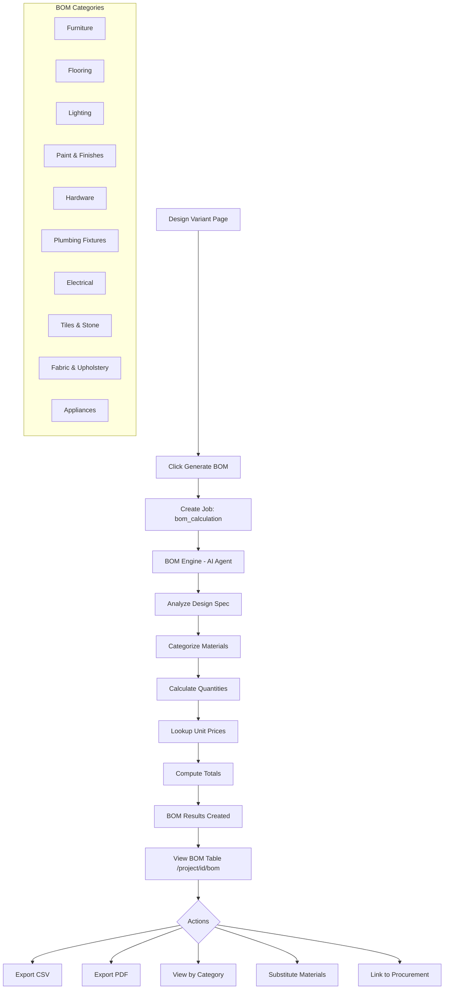
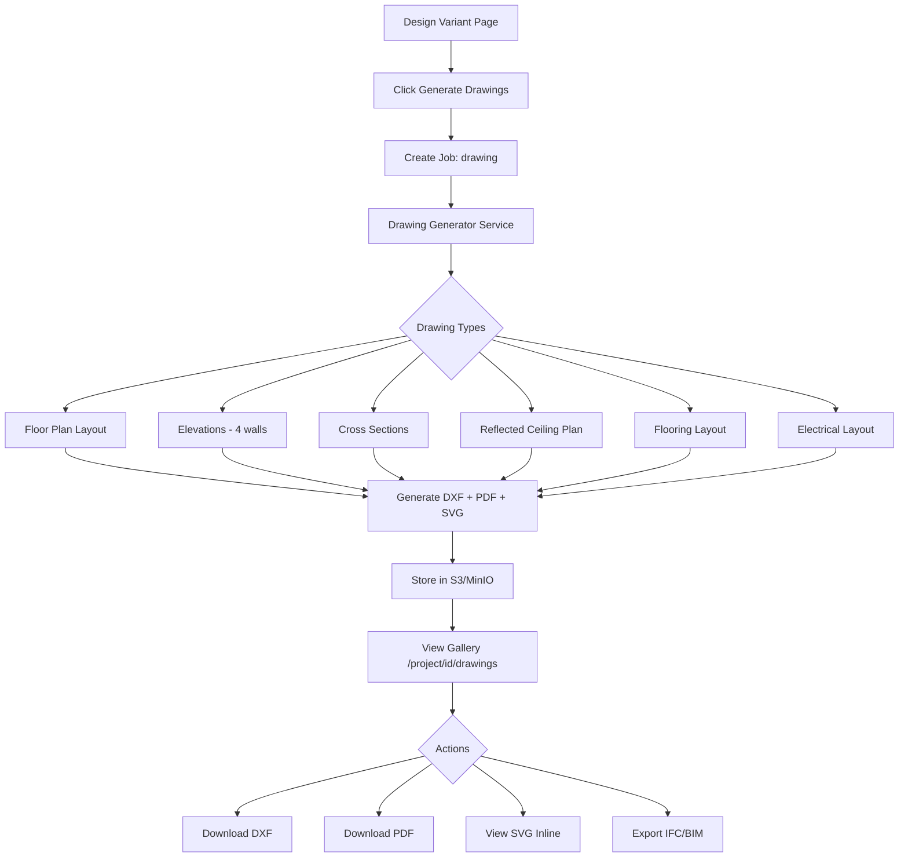
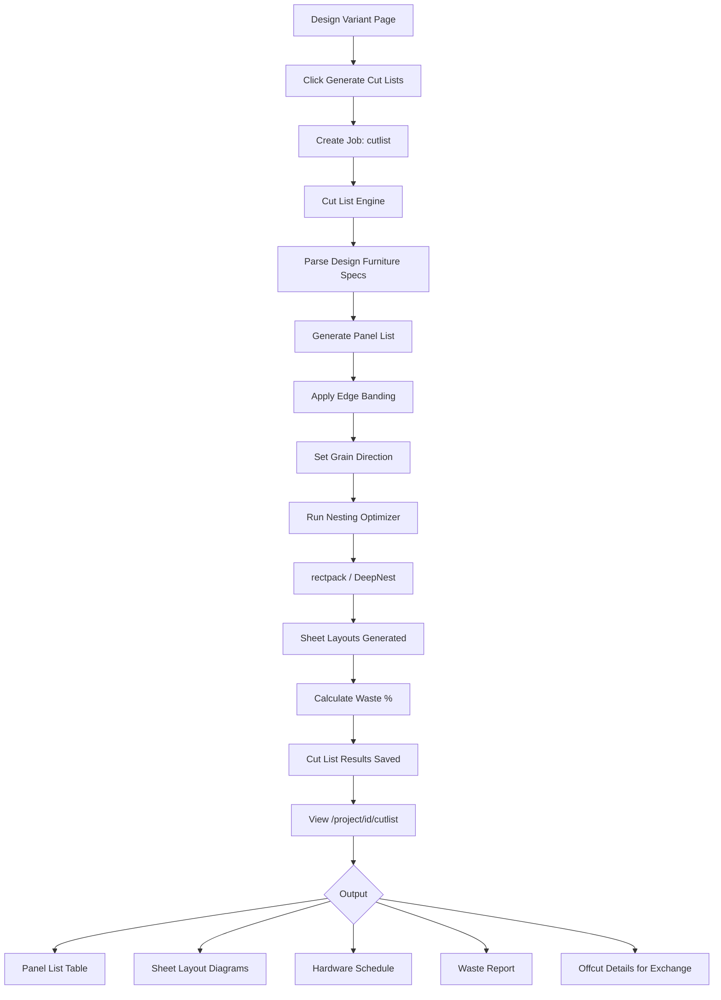
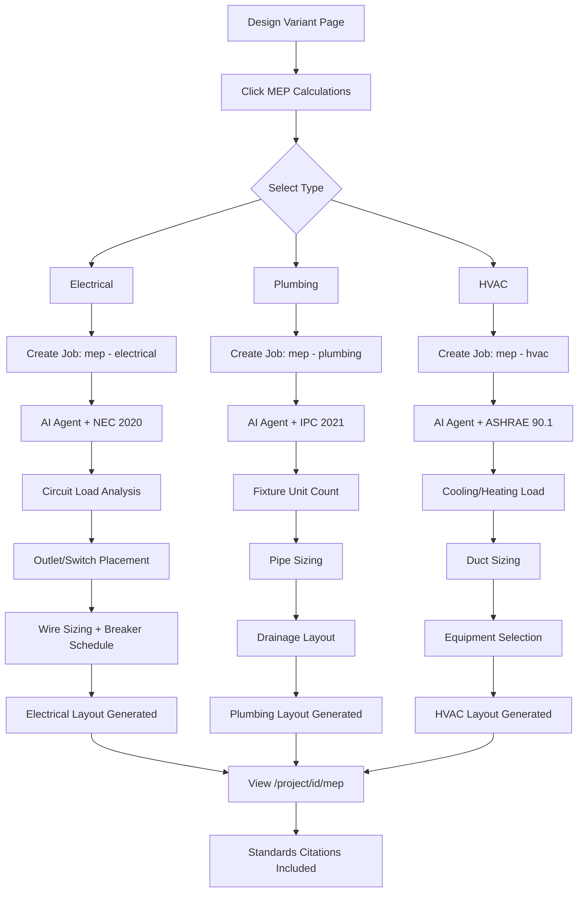

# OpenLintel - User Flow Diagrams

> Comprehensive user journey maps for the end-to-end home design automation platform.

---

## Table of Contents

1. [High-Level Platform Flow](#1-high-level-platform-flow)
2. [Authentication & Onboarding](#2-authentication--onboarding)
3. [Project Creation & Setup](#3-project-creation--setup)
4. [Room Management](#4-room-management)
5. [Design Generation Pipeline](#5-design-generation-pipeline)
6. [Floor Plan Digitization](#6-floor-plan-digitization)
7. [3D Editor & Collaboration](#7-3d-editor--collaboration)
8. [BOM, Drawings & Manufacturing](#8-bom-drawings--manufacturing)
9. [MEP Engineering](#9-mep-engineering)
10. [Project Timeline & Scheduling](#10-project-timeline--scheduling)
11. [Procurement & Delivery](#11-procurement--delivery)
12. [Payments & Invoicing](#12-payments--invoicing)
13. [Contractor Marketplace](#13-contractor-marketplace)
14. [Quality Assurance & Handover](#14-quality-assurance--handover)
15. [Intelligence & Analytics](#15-intelligence--analytics)
16. [Post-Occupancy (Digital Twin, Maintenance, Warranty)](#16-post-occupancy)
17. [Marketplace & Community](#17-marketplace--community)
18. [Admin Panel](#18-admin-panel)
19. [Developer API Portal](#19-developer-api-portal)

---

## 1. High-Level Platform Flow



---

## 2. Authentication & Onboarding

```mermaid
flowchart TD
    A[Landing Page /] --> B[Click Sign In]
    B --> C[/auth/signin]

    C --> D{Choose Auth Method}
    D -->|Google OAuth| E[Google Consent Screen]
    D -->|GitHub OAuth| F[GitHub Authorization]
    D -->|Email + Password| G[Enter Credentials]

    E --> H{Account Exists?}
    F --> H
    G --> H

    H -->|No| I[Create User Record]
    I --> J[Set Default Preferences]
    J --> K[Redirect to Dashboard]

    H -->|Yes| K

    K --> L[/dashboard]
    L --> M{First Visit?}
    M -->|Yes| N[Show Onboarding Tour]
    N --> O[Configure Preferences]
    O --> P[Set Currency / Units / Locale]
    P --> Q[Add LLM API Keys - Optional]
    Q --> R[Dashboard Ready]

    M -->|No| R
```

### User Preferences Setup

```mermaid
flowchart LR
    A[/dashboard/settings] --> B[Profile Section]
    B --> C[Name / Email / Avatar]

    A --> D[Preferences Section]
    D --> E[Currency: USD, INR, EUR, GBP...]
    D --> F[Unit System: Metric / Imperial]
    D --> G[Locale: en, hi, es...]

    A --> H[API Keys Section]
    H --> I[Add OpenAI Key]
    H --> J[Add Anthropic Key]
    H --> K[Add Google Key]

    I --> L[AES-256-GCM Encryption]
    J --> L
    K --> L
    L --> M[Store Encrypted Key + IV + AuthTag]
```

---

## 3. Project Creation & Setup



---

## 4. Room Management



---

## 5. Design Generation Pipeline



### Style Quiz Flow

```mermaid
flowchart TD
    A[/project/id/style-quiz] --> B[Step 1: Room Usage]
    B --> C[Step 2: Color Preferences]
    C --> D[Step 3: Material Preferences]
    D --> E[Step 4: Budget Range]
    E --> F[Step 5: Inspiration Images]

    F --> G[Submit Quiz]
    G --> H[AI Analyzes Responses]
    H --> I[Detected Styles with Scores]
    I --> J[Auto-Generated Mood Board]
    J --> K[Color Palette Suggestions]
    K --> L[Save Style Preferences]
    L --> M[Use in Design Generation]
```

---

## 6. Floor Plan Digitization



---

## 7. 3D Editor & Collaboration



---

## 8. BOM, Drawings & Manufacturing

### BOM Flow



### Technical Drawings Flow



### CNC Cut Lists Flow



---

## 9. MEP Engineering



---

## 10. Project Timeline & Scheduling

```mermaid
flowchart TD
    A[Project Page] --> B[Timeline Tab /project/id/timeline]

    B --> C[Click Generate Schedule]
    C --> D[AI Analyzes Project Scope]
    D --> E[Generate Tasks & Dependencies]
    E --> F[Identify Critical Path]
    F --> G[Set Milestones]

    G --> H[Gantt Chart View]
    H --> I{Actions}
    I --> J[Adjust Task Dates]
    I --> K[Link Milestones to Payments]
    I --> L[Export Schedule]

    subgraph "Site Logs"
        M[/project/id/site-logs] --> N[Create Daily Log]
        N --> O[Date + Title + Notes]
        O --> P[Weather + Worker Count]
        P --> Q[Upload Photos]
        Q --> R[Add Tags]
    end

    subgraph "Change Orders"
        S[/project/id/change-orders] --> T[Propose Change]
        T --> U[AI Estimates Cost & Time Impact]
        U --> V{Review}
        V -->|Approve| W[Update Schedule & BOM]
        V -->|Reject| X[Change Rejected]
    end
```

---

## 11. Procurement & Delivery

```mermaid
flowchart TD
    A[BOM Approved] --> B[/project/id/procurement]

    B --> C[Create Purchase Order]
    C --> D[Select Vendor]
    D --> E[Add Line Items from BOM]
    E --> F[Set Quantities & Prices]
    F --> G[Submit PO]

    G --> H[PO Status: draft]
    H --> I[Submit to Vendor]
    I --> J[PO Status: submitted]
    J --> K[Vendor Confirms]
    K --> L[PO Status: confirmed]
    L --> M[Vendor Ships]
    M --> N[PO Status: shipped]
    N --> O[Materials Arrive]
    O --> P[PO Status: delivered]

    subgraph "Delivery Tracking"
        Q[/project/id/deliveries] --> R[Track Delivery]
        R --> S[Status: pending]
        S --> T[Status: dispatched]
        T --> U[Status: in_transit]
        U --> V[Status: delivered]
        V --> W[Inspection Checklist]
        W --> X{Pass?}
        X -->|Yes| Y[Status: inspected]
        X -->|No| Z[Status: rejected]
    end

    subgraph "Vendor Management"
        VA[/project/id/vendors] --> VB[View Vendor Ratings]
        VB --> VC[Delivery Score]
        VB --> VD[Quality Score]
        VB --> VE[Pricing Score]
        VB --> VF[Order History]
    end
```

---

## 12. Payments & Invoicing

```mermaid
flowchart TD
    A[/project/id/payments] --> B{Payment Type}

    B --> C[Milestone-Linked Payment]
    B --> D[Direct Payment]

    C --> E[Select Milestone]
    E --> F[Enter Amount]
    F --> G{Payment Provider}
    G --> H[Stripe Checkout]
    G --> I[Razorpay Checkout]

    H --> J[Payment Processing]
    I --> J
    J --> K{Result}
    K -->|Success| L[Status: completed]
    K -->|Failure| M[Status: failed]

    L --> N[Update Milestone Status]
    N --> O[Send Notification]
    O --> P[Generate Invoice]

    subgraph "Invoice Lifecycle"
        Q[Invoice Created] --> R[Status: draft]
        R --> S[Send Invoice]
        S --> T[Status: sent]
        T --> U{Payment Received?}
        U -->|Yes| V[Status: paid]
        U -->|Overdue| W[Status: overdue]
    end

    subgraph "Financial Reports"
        FR[/project/id/financial-reports] --> FR1[Budget vs. Actuals]
        FR --> FR2[Expenditure Timeline]
        FR --> FR3[Category Breakdown]
        FR --> FR4[Per Sq-ft Benchmarks]
    end
```

---

## 13. Contractor Marketplace

```mermaid
flowchart TD
    A[/marketplace] --> B[Search Contractors]

    B --> C[Filter by City]
    B --> D[Filter by Specialization]
    B --> E[Filter by Rating]
    B --> F[Filter by Verified Status]

    C --> G[Results List]
    D --> G
    E --> G
    F --> G

    G --> H[View Profile /marketplace/contractorId]
    H --> I[See Bio & Portfolio]
    H --> J[See Reviews & Ratings]
    H --> K[See Certifications]
    H --> L[See Years Experience]

    H --> M{Actions}
    M --> N[Hire Contractor]
    N --> O[Assign to Project]
    O --> P[Set Role & Dates]
    P --> Q[Set Agreed Amount]
    Q --> R[Contractor Assignment Created]

    M --> S[Write Review]
    S --> T[Rate 1-5 Stars]
    T --> U[Add Title & Review Text]
    U --> V[Review Published]

    M --> W[Refer to Friend]
    W --> X[Enter Referee Email]
    X --> Y[Referral Sent]
```

---

## 14. Quality Assurance & Handover

### QA & Punch List

```mermaid
flowchart TD
    A[/project/id/quality] --> B[Quality Checkpoints]

    B --> C[Create Checkpoint]
    C --> D[Select Milestone Stage]
    D --> E[Select Trade]
    E --> F[Add Checklist Items]
    F --> G[Assign Inspector]

    G --> H{Inspection}
    H --> I[Check Each Item]
    I --> J[Upload Inspection Photos]
    J --> K{All Pass?}
    K -->|Yes| L[Checkpoint: passed]
    K -->|No| M[Checkpoint: failed]

    M --> N[Create Punch List Items]
    N --> O[Set Severity: critical/major/minor]
    O --> P[Assign to Contractor]
    P --> Q[Contractor Fixes Issue]
    Q --> R[Mark as Resolved]
    R --> S[Verify Fix]
    S --> T[Mark as Verified]
```

### Handover Package

```mermaid
flowchart TD
    A[/project/id/handover] --> B[Generate Handover Package]

    B --> C[Compile As-Built Drawings]
    C --> D[Generate Material Register]
    D --> E[Compile Contractor Directory]
    E --> F[Create Operational Guides]
    F --> G[Generate Maintenance Manual PDF]

    G --> H[Handover Package Ready]
    H --> I{Client Review}
    I --> J[Client Signs Off]
    J --> K[Package Delivered]
    K --> L[Project Status: completed]

    subgraph "Handover Contents"
        HC1[As-Built Drawings DXF/PDF]
        HC2[Material Register with Batch Numbers]
        HC3[Contractor Directory with Contacts]
        HC4[System Operational Guides]
        HC5[Maintenance Manual]
        HC6[Warranty Documents]
    end
```

---

## 15. Intelligence & Analytics

```mermaid
flowchart TD
    A[/dashboard/analytics] --> B{Analytics Views}

    B --> C[Budget vs. Actual Chart]
    B --> D[Cost Breakdown by Category]
    B --> E[Timeline Progress]
    B --> F[Per Sq-ft Benchmarks]
    B --> G[Export CSV]

    subgraph "AI Predictions"
        H[/project/id/predictions] --> I[Generate Cost Prediction]
        I --> J[LLM Analyzes Project Data]
        J --> K[Predicted Cost + Confidence Range]
        K --> L[Risk Factors Identified]

        H --> M[Generate Timeline Prediction]
        M --> N[Predicted Days + Confidence]
        N --> O[Critical Risks & Mitigations]
        O --> P[Phase Breakdown]
    end

    subgraph "Budget Optimizer"
        Q[/project/id/budget-optimizer] --> R[Generate Scenarios]
        R --> S[AI Suggests Material Substitutions]
        S --> T[Show Savings per Substitution]
        T --> U{Accept?}
        U -->|Yes| V[Update BOM]
        U -->|No| W[Keep Original]
    end

    subgraph "Sustainability"
        X[/project/id/sustainability] --> Y[Generate Report]
        Y --> Z[Total Carbon Footprint]
        Z --> AA[LEED Points Estimate]
        AA --> AB[Green Alternatives Suggested]
    end
```

---

## 16. Post-Occupancy

### Digital Twin & IoT

```mermaid
flowchart TD
    A[/project/id/digital-twin] --> B[Create Digital Twin]
    B --> C[Upload/Generate 3D Model]
    C --> D[Twin Status: active]

    D --> E[Add IoT Devices]
    E --> F{Device Types}
    F --> G[Temperature Sensor]
    F --> H[Humidity Sensor]
    F --> I[Motion Sensor]
    F --> J[Energy Meter]
    F --> K[Water Flow Sensor]

    G --> L[Position in Room]
    H --> L
    I --> L
    J --> L
    K --> L

    L --> M[Live Dashboard]
    M --> N[Real-time Sensor Readings]
    M --> O[Historical Charts]
    M --> P[Alert Thresholds]

    D --> Q[Emergency References]
    Q --> R[Water Shutoff Location]
    Q --> S[Gas Shutoff Location]
    Q --> T[Electrical Breaker Panel]
    Q --> U[Fire Extinguisher Locations]
```

### Maintenance & Warranties

```mermaid
flowchart TD
    A[/project/id/maintenance] --> B[Maintenance Schedules]
    B --> C[Add Maintenance Item]
    C --> D[Set Category & Frequency]
    D --> E[Set Next Due Date]
    E --> F[Assign Provider]
    F --> G[Set Estimated Cost]

    G --> H[Schedule Active]
    H --> I{Due Date Reached}
    I --> J[Notification Sent]
    J --> K[Log Completion]
    K --> L[Record Cost & Notes]
    L --> M[Upload Photos]
    M --> N[Auto-Calculate Next Due Date]

    subgraph "Warranties"
        O[/project/id/warranties] --> P[Add Warranty]
        P --> Q[Item + Brand + Serial Number]
        Q --> R[Start & End Date]
        R --> S[Warranty Type]

        S --> T{Claim Needed?}
        T -->|Yes| U[File Warranty Claim]
        U --> V[Describe Issue + Photos]
        V --> W[Claim Status: filed]
        W --> X[Claim Status: in_review]
        X --> Y{Decision}
        Y -->|Approved| Z[Claim Resolved]
        Y -->|Denied| AA[Claim Denied]
    end
```

---

## 17. Marketplace & Community

### Product Catalogue

```mermaid
flowchart TD
    A[/marketplace/catalogue] --> B{Search Methods}
    B --> C[Text Search]
    B --> D[Category Browse]
    B --> E[Visual Similarity Search]

    C --> F[Meilisearch Full-Text]
    D --> G[Hierarchical Category Tree]
    E --> H[Upload Image - CLIP/pgvector]

    F --> I[Product Results]
    G --> I
    H --> I

    I --> J[Product Detail Page]
    J --> K[Multi-Vendor Price Comparison]
    J --> L[Specifications & Dimensions]
    J --> M[Similar Products]
    J --> N[Add to BOM]
```

### Offcuts Exchange

```mermaid
flowchart TD
    A[/marketplace/offcuts] --> B{Role}

    B -->|Seller| C[List Offcut Material]
    C --> D[Material Type + Quantity]
    D --> E[Dimensions & Condition]
    E --> F[Set Price + Upload Photos]
    F --> G[Listing Active]

    B -->|Buyer| H[Browse Listings]
    H --> I[Filter by Material/Location]
    I --> J[View Listing Detail]
    J --> K[Send Inquiry]
    K --> L[Seller Responds]
    L --> M{Deal?}
    M -->|Yes| N[Mark as Sold]
    M -->|No| O[Decline]
```

### Community Gallery

```mermaid
flowchart TD
    A[/marketplace/gallery] --> B[Browse Public Projects]
    B --> C[Filter by Style]
    B --> D[Filter by Tags]
    B --> E[Sort by Likes]

    F[Project Owner] --> G[Publish to Gallery]
    G --> H[Add Title & Description]
    H --> I[Select Images]
    I --> J[Set Style Tag]
    J --> K[Entry Published]

    B --> L[View Entry Detail]
    L --> M[Like Project]
    L --> N[View Design Details]
```

---

## 18. Admin Panel

```mermaid
flowchart TD
    A[Admin Login - role: admin] --> B[/admin]

    B --> C[Dashboard]
    C --> D[Total Users Count]
    C --> E[Total Projects Count]
    C --> F[Active Jobs Count]
    C --> G[System Health Status]

    B --> H[User Management /admin/users]
    H --> I[List All Users]
    I --> J[Toggle User Enabled/Disabled]
    I --> K[Change User Role]
    I --> L[View User Projects]

    B --> M[Job Queue /admin/jobs]
    M --> N[View All Jobs]
    N --> O[Filter by Status]
    N --> P[Filter by Type]
    N --> Q[Cancel Stuck Jobs]
    N --> R[Retry Failed Jobs]

    B --> S[System Health /admin/system]
    S --> T[Database Connection Status]
    S --> U[Storage Service Status]
    S --> V[ML Service Status]
    S --> W[Queue Depth Metrics]
```

---

## 19. Developer API Portal

```mermaid
flowchart TD
    A[/developer] --> B[Register New App]
    B --> C[Enter App Name]
    C --> D[Set Redirect URIs]
    D --> E[Select Scopes]
    E --> F[App Created]
    F --> G[Receive Client ID + Secret]

    G --> H[Generate Access Token]
    H --> I[OAuth Authorization Flow]
    I --> J[Access Token Issued]

    J --> K{API Usage}
    K --> L[Read Projects]
    K --> M[Read BOMs]
    K --> N[Read Drawings]
    K --> O[Trigger Jobs]

    A --> P[Webhook Subscriptions]
    P --> Q[Select Event Type]
    Q --> R[Set Target URL]
    R --> S[Set Secret for Signing]
    S --> T[Webhook Active]

    A --> U[Request Logs]
    U --> V[View API Call History]
    V --> W[Endpoint + Method + Status]
    V --> X[Response Time Metrics]

    subgraph "Rate Limits"
        RL1[Standard: 100 req/min]
        RL2[Premium: 500 req/min]
        RL3[Enterprise: 2000 req/min]
    end
```

---

## Notification Flow (Cross-cutting)

```mermaid
flowchart TD
    A{Event Trigger} --> B[Create Notification Record]
    B --> C[WebSocket Push to Client]
    C --> D[Bell Icon Badge Updated]
    D --> E[User Opens Notification Center]
    E --> F[Mark as Read]
    E --> G[Click Through to Link]

    A --> H{Event Types}
    H --> I[Job Completed]
    H --> J[Comment Added]
    H --> K[Approval Requested]
    H --> L[Payment Received]
    H --> M[Delivery Arrived]
    H --> N[Change Order Updated]
    H --> O[Maintenance Due]
    H --> P[Warranty Expiring]
```

---

## Building Code Compliance Flow

```mermaid
flowchart TD
    A[/project/id/compliance] --> B[Run Compliance Check]

    B --> C{Select Jurisdiction}
    C --> D[India - NBC 2016]
    C --> E[US - IRC 2021]
    C --> F[EU - Eurocode]
    C --> G[UK - Building Regs]

    D --> H[AI Checks Design Against Code]
    E --> H
    F --> H
    G --> H

    H --> I[Compliance Report]
    I --> J{Result}
    J -->|All Pass| K[Compliant Badge]
    J -->|Issues Found| L[List Violations]
    L --> M[Severity Level per Issue]
    M --> N[Remediation Suggestions]
    N --> O[Re-check After Fixes]
```

---

## Data Flow Summary

```mermaid
flowchart LR
    subgraph "User Input"
        A1[Photos]
        A2[Floor Plans]
        A3[Dimensions]
        A4[Style Preferences]
        A5[Budget]
    end

    subgraph "AI Processing"
        B1[Vision Engine]
        B2[Design Engine]
        B3[BOM Engine]
        B4[Drawing Generator]
        B5[Cut List Engine]
        B6[MEP Calculator]
    end

    subgraph "Outputs"
        C1[Design Renders]
        C2[Bill of Materials]
        C3[DXF/PDF Drawings]
        C4[CNC Cut Lists]
        C5[MEP Layouts]
        C6[Schedules]
    end

    subgraph "Execution"
        D1[Procurement]
        D2[Contractor Hiring]
        D3[Construction]
        D4[Quality Checks]
        D5[Handover]
    end

    A1 --> B1
    A2 --> B1
    A3 --> B2
    A4 --> B2
    A5 --> B2
    B1 --> B2
    B2 --> C1
    B2 --> B3
    B2 --> B4
    B2 --> B5
    B2 --> B6
    B3 --> C2
    B4 --> C3
    B5 --> C4
    B6 --> C5
    C2 --> D1
    C3 --> D2
    C6 --> D3
    D3 --> D4
    D4 --> D5
```
